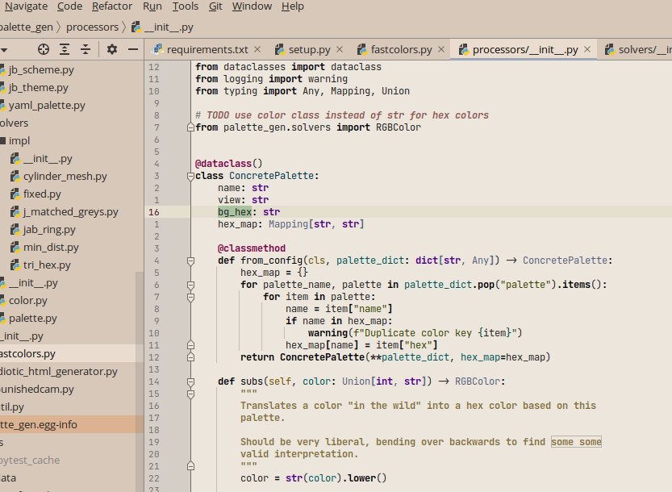
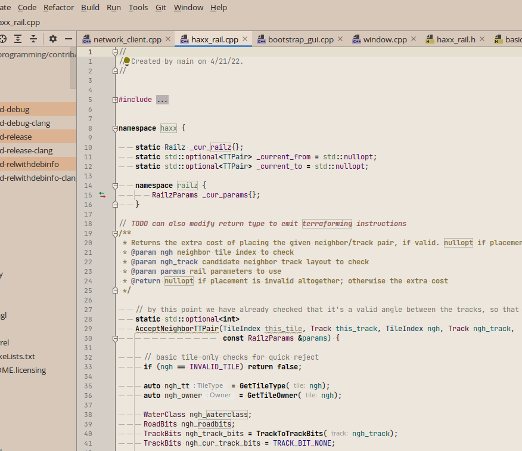

# Restrained Salmon




Now that dark mode is sweeping the world, true hipsters must migrate to using
light themes. This is one such theme.

## The Salmon Theme

Originally this theme used the FT salmon color directly. Now, it's only loosely
inspired by it -- but the name stays. All theme colors are generated jointly
from the scheme colors from the same palette spec for maximum harmony.

The effect is to create a clear division into exactly two areas: the grey editor
field, and the reddish, "calming" UI field outside it. Yes -- the interior in
that screenshot is a grey, generated for 6000K. It might look very redshifted in
the context of a white screen, but once your eyes adapt (and assuming your view
conditions match those for which the theme was generated -- a dim room)
it will look neutral. Chromatic adaptation is a hell of a drug.

## The Restraint Scheme

This is the interesting bit, designed with all the power of
[palette_gen](https://github.com/qdbp/palette_gen).

The name suggests muted colors, which is necessary for a light scheme to avoid
retinal destruction. Function declarations, default identifiers and keywords are
greyscale to further this effect.

### Design Language

Further to trying for restrained colors, I attempt to follow a visual design
language, outlined in this section. Its dictates are interpreted as gentle
guidelines and are not followed whenever the result is fugly.

#### Bold Is Control Flow

The only things that are bold are keywords, function calls and any other
language construct -- modulo my ability to select it for highlighting -- that
alters control flow. Nothing else is bold: not declarations, not global
variables, etc.

I believe this creates a very nice effect. Glancing at a block of code, its structure
and its calls visually pop! to give a high-level impression at a glance, without
being crowded out by identifier specifics.

#### Italics are Mutability

Wherever sensible, mutable variables or mutation in general are denoted by
italics. This is interpreted sensibly, in that I don't, for instance, make every
variable in Python or every non-final variable in Java italic. However, in Java
I italicize variables that are reassigned, and so on.

#### Color Is Semantics

The most important fact about colors in this theme is that they have global,
cross-language semantics. Each color is assigned a specific meaning such as,
namespace, global variable, interface, number, etc. This color is then used as
exclusively as possible in this role across languages.

These interpretations, of course, have to be stretched depending on the
particular language; however, I always aim to keep the meanings as true as
possible.

Generally, lower-brightness colors are used for type variables and literals.
Colors of medium brightness are used for various mundane identifiers, while the
brightest colors are reserved for global concepts such as labels, constants, and
builtins. Within each of these categories, colors are assigned to try make as
many languages look as pleasing as possible given the semantic consistency
constraint.

The perceptual uniformity of the primary colors ensures that even within this
framework, for any given language the balance of tones looks rather nice, if not
the best it could if colors had free per-language semantics.

### Supported Languages

The following languages have had all of their fields styled to work with the
theme according to its design language. Some have been more attentively tuned
than others, but none should have any glaring issues.

#### Programming languages

- C/C++
- Java
- JavaScript
- Kotlin
- Python
- Shell
- TypeScript

#### Other File Types

- JSON
- SQL
- XML
- YAML

### Support

Inclusion and only inclusion on the above lists means I am open to fixing bugs
and serious aesthetic defects in the associated themes. I am open to theming
other languages by popular demand.

## Installation

Install from
the [JetBrains marketplace](https://plugins.jetbrains.com/plugin/16259-restrained-salmon-theme):

## Architecture

The theme is generated using an end-to-end pipeline going from color palette
specifications through theme and scheme config. This is controlled by three
files:

- `colorspec.yaml`
- `scheme.yaml`
- `theme.yaml`

The first of these defines the viewing conditions (e.g. 6000K, 20 cd/m²
background illumination) and specifications for generating named palettes of
colors within these conditions from a bespoke colorspace. This gets fancy -- for
the full details, see the sister
project [palette_gen](https://github.com/qdbp/palette_gen)

The other two are fairly straightforward mappings to the `.theme.json` theme
file and the `.xml` color scheme file that define the theme's appearance. These
are also preprocessed by functions defined in `palette_gen`.

This build system provides a high degree of indirection between abstract
specification and concrete layout, allowing defining relationships between
colors and to propagate palette tweaks globally with a single build step. This
allows for very rapid iteration. If you are a theme designer, I encourage you to
give this system a try.

### Building

First, you need to install `palette_gen`. Then, run

```
make <night|twilight|day>
```

to generate the `theme.json` and `.xml` color scheme files. After this, build
the plugin with IDEA. At this point I use the build-in build system vs. Gradle,
so I leave it to the reader to figure out how to actually package the plugin.
However, this is not necessary to just experiment with the `.theme.json` file.

## Roadmap

~~Since `palette_gen` supports multiple view settings, being able to dynamically
change the color scheme based on lighting conditions, etc., seems like a
tantalizing possibility...~~ DONE

Right now, only the twilight theme is generated and propagated. It might be nice to
expose some sort of view-condition customization handles (as well as others)
directly to the user to not have to pre-bake 50 different themes to cover all
possible lighting settings.

Other than that, I think this thing is basically, like, flawless.

It was a lot of effort to seemingly reinvent one of many themes like it, like
[gruvbox](https://github.com/morhetz/gruvbox), from first principles. But this
one is mine.

